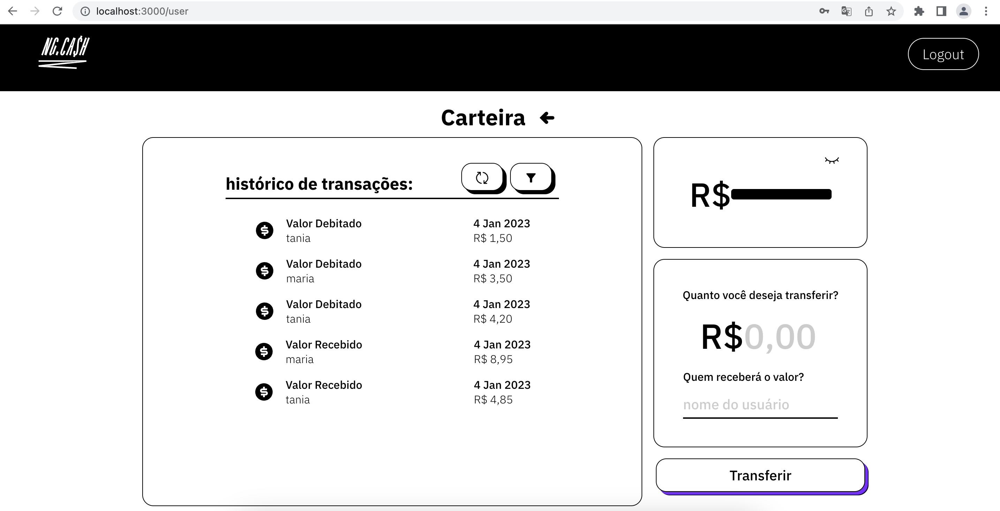

<h1>NG.CASH Internet Banking</h1>

Este é um projeto fullstack desenvolvido como parte do desafio técnico para o cargo de desenvolvedor front end da empresa NG.CASH.

<ul>
<li>O back end foi desenvolvido utilizando Node.js com TypeORM e banco de dados Postgresql.</li>
<li>O front end foi desenvolvido utilizando React.</li>
<li>Foi utilizado TypeScript tanto no Back End quanto no Front End.</li>
<li>A aplicação foi deckerizada utilizando Docker, sendo possível rodar a aplicação com apenas uma linha de comando, quando ela estiver na sua máquina.</li>
</ul>

<h3>Como rodar esta aplicação fullstack no seu computador?</h3>

1) Clonar o repositório 

 $ git clone https://github.com/dieegomr/ngcash.git

2) Abra a pasta do projeto no terminal

3) Rode a linha de comando: docker-compose up -d

3) Acesse http://localhost:3000 no seu navegador
